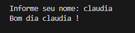
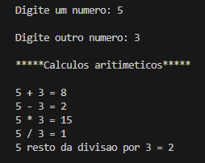
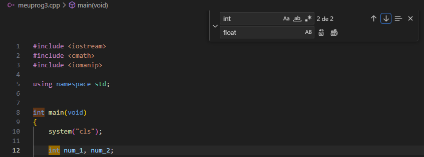
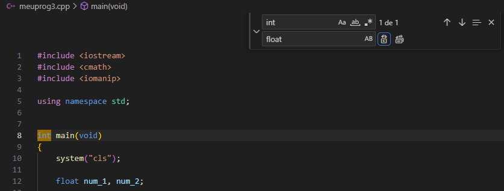
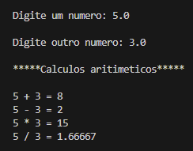
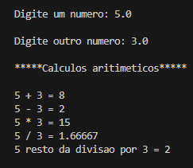

# Exercicio 1: 

# Exercicio 2:
#### Tá no GitHub com o nome: meuprog1.cpp

# Exercicio 3:
#### Não foi detectado nenhum erro no programa, após o debugger.

# Exercicio 4:
#### Tá no GitHub com o nome: meuprog2.cpp

# Exercicio 5:

# Exercicio 6:
#### Tá no GitHub com o nome: meuprog3.cpp

# Exercicio 7:

* #### Lista de Extensões do meu VS-Code:
  * Bracket Pair Color DLW
  * C/C++
  * C/C++ Build Task
  * C/C++ Compile Run
  * C/C++ Themes
  * CMake
  * CMake Tools
  * Color Highlight
  * cpp-include-complete
  * Dev Containers
  * Docker
  * Dracula Official
  * Error Lens
  * GitLens — Git supercharged
  * Prettier - Code formatter
  * Start git-bash
  * VSCode C++ Class Completion
  * Tabnine: AI Autocomplete & Chat for Javascript, Python, Typescript, PHP, Go, Java & more

# Exercicio 8:

* #### Extensões de minha preferencia:
    * #### vscode-icons : Serve para modificar os ícones dos arquivos criados no vs-code, após sua instalação os ícones de meus arquivos ficaram mais visíveis e mais fácil de identificá-los.

    * #### Portuguese (Brazil) Language Pack for Visual Studi : Serve para alterar o idioma do vc-code para português (Brasil), após ser instalado modificou o idioma do inglês para o português do vs-code.

# Exercicio 9:
#### Para usar o tema Drácula na IDE, basta clicar em habilitar, após a sua instalação. 

#### Mas como eu não gostei muito do Drácula, uso o do vc-code padrão, que para retornar para ele eu só desabilitei o Drácula.
  